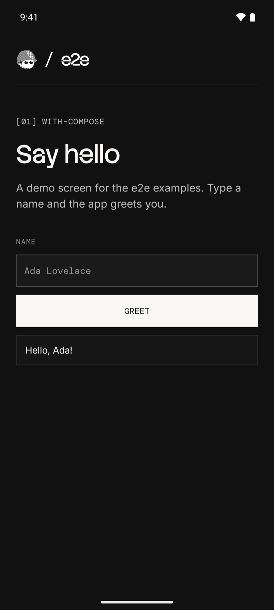
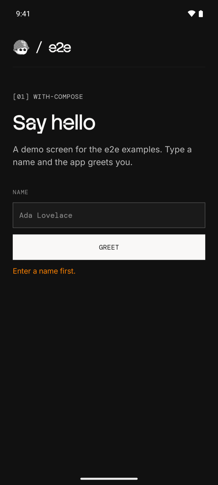

# e2e with Jetpack Compose

A Jetpack Compose greeting app for Android with three locator tests and two
agent tests. The test project is in `e2e/`, next to the Gradle project.

 

## Run

Install [Android Studio](https://developer.android.com/studio) with an
Android emulator. Start the emulator, open this folder in Android Studio,
and press **Run**.

To build from a terminal instead, point Gradle at a JDK 17+ and the
Android SDK. On macOS, Android Studio's defaults are:

```bash
export JAVA_HOME="/Applications/Android Studio.app/Contents/jbr/Contents/Home"
export ANDROID_HOME="$HOME/Library/Android/sdk"
./gradlew installDebug
```

Use Node 22.22.3+, 24.8+, or 26+ for the tests. From this folder:

```bash
cd e2e
npm install
npx agent-device doctor
npm run test:e2e
```

After app changes, build and install again before you run the tests.

## Agent tests

Set a [Vercel AI Gateway](https://vercel.com/docs/ai-gateway) key.
From `e2e/`:

```bash
AI_GATEWAY_API_KEY="your-key" npm run test:e2e
```

Without the key, the agent tests skip. Add `-- --no-cache` to use fresh
model calls. Results are in `e2e/.e2e/report.json`.

`getByTestId` finds a Compose `testTag` once the screen sets
`testTagsAsResourceId`; see [GreetingScreen.kt](app/src/main/kotlin/dev/e2e/examples/compose/GreetingScreen.kt).
See [e2e/e2e.config.ts](e2e/e2e.config.ts) and [e2e/tests/](e2e/tests/) for the setup.
For device setup and CI, see the [Mobile guide](https://e2e.tester.army/docs/mobile).

The bundled fonts use the [SIL Open Font License](app/src/main/assets/OFL.txt).

Last checked on 2026-10-06 with e2e 0.18.0, @e2e-dev/mobile 0.10.0, Kotlin
2.4.20, AGP 9.4.1, and Compose BOM 2026.09.00 on an Android 16 emulator.
Three locator tests passed; the agent tests skipped without a key.
