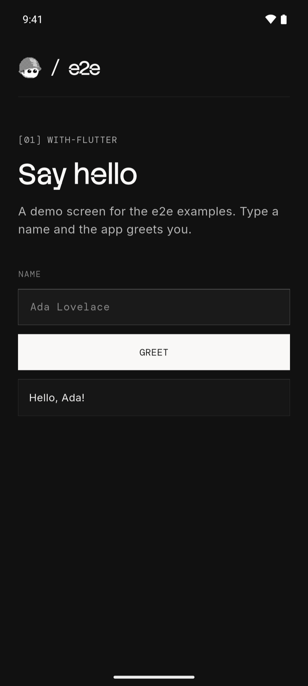
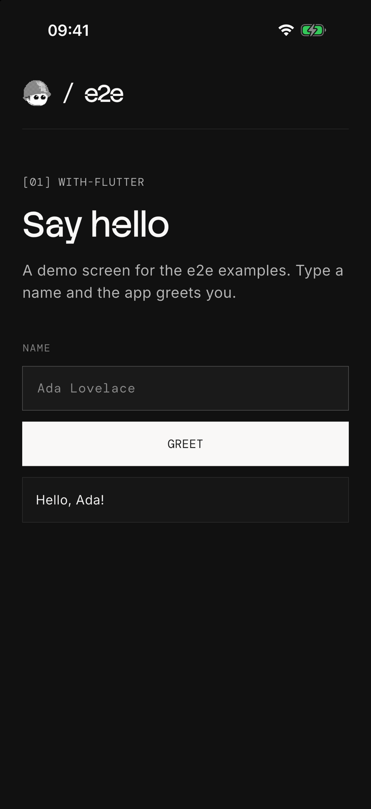

# e2e with Flutter

A Flutter greeting app with three locator tests and two agent tests per
platform. The test project is in `e2e/`, next to the Flutter project.

 

## Run

[Install Flutter](https://docs.flutter.dev/get-started/install) with the
Android SDK, Xcode, or both. Start an emulator or simulator, then build and
install the app from this folder:

| Platform | Build | Install |
| --- | --- | --- |
| Android | `flutter build apk` | `flutter install` |
| iOS | `flutter build ios --simulator` | `flutter install` |

With more than one device running, pick one with `flutter install -d <id>`;
`flutter devices` lists the ids.

Use Node 22.22.3+, 24.8+, or 26+ for the tests. From this folder:

```bash
cd e2e
npm install
npx agent-device doctor
npm run test:e2e:android   # or test:e2e:ios
```

After app changes, build and install again before you run the tests.

## Agent tests

Set a [Vercel AI Gateway](https://vercel.com/docs/ai-gateway) key.
From `e2e/`:

```bash
AI_GATEWAY_API_KEY="your-key" npm run test:e2e:android
```

Without the key, the agent tests skip. Add `-- --no-cache` to use fresh
model calls. Results are in `e2e/.e2e/report.json`.

`getByTestId` finds the `identifier` of a `Semantics` widget: the resource id
on Android, the accessibility identifier on iOS. See [lib/main.dart](lib/main.dart).
See [e2e/e2e.config.ts](e2e/e2e.config.ts) and [e2e/tests/](e2e/tests/) for the setup.
For device setup and CI, see the [Mobile guide](https://e2e.tester.army/docs/mobile).

The bundled fonts use the [SIL Open Font License](assets/fonts/OFL.txt).

Last checked on 2026-10-06 with e2e 0.18.0, @e2e-dev/mobile 0.10.0, and
Flutter 3.47 on an Android 16 emulator and an iOS 26 simulator. Three locator
tests passed on each; the agent tests skipped without a key.
