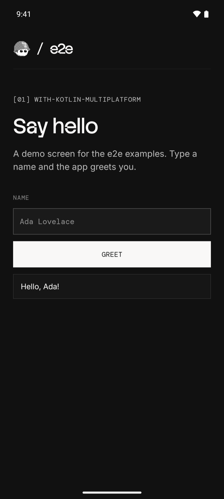
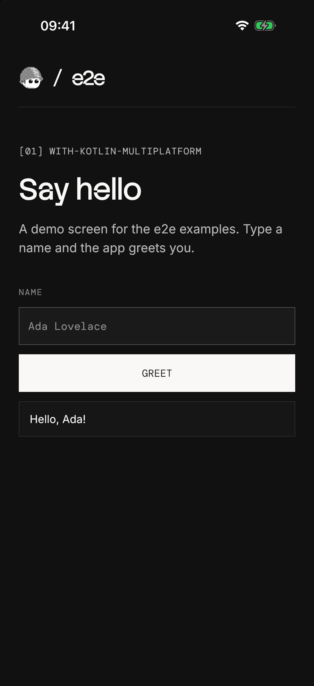

# e2e with Kotlin Multiplatform

A Compose Multiplatform greeting app with three locator tests and two agent
tests per platform. Android and iOS share one screen in `shared/`. The test
project is in `e2e/`, next to the Gradle project.

 

## Run

Install [Android Studio](https://developer.android.com/studio) with an
Android emulator, Xcode with an iOS simulator, or both. Start an emulator
or simulator, then build and install the app:

| Platform | Build and install |
| --- | --- |
| Android | Open this folder in Android Studio, select the **androidApp** configuration, and press **Run** |
| iOS | Open `iosApp/iosApp.xcodeproj` in Xcode, select an iPhone simulator, and press **Run** |

The Xcode build compiles the shared Kotlin code through Gradle first, so the
first iOS build takes a few minutes. It uses `JAVA_HOME`, or Android
Studio's bundled JDK when that is unset. Stop the Xcode run before you
start the tests.

To build Android from a terminal instead, point Gradle at a JDK 17+ and the
Android SDK. On macOS, Android Studio's defaults are:

```bash
export JAVA_HOME="/Applications/Android Studio.app/Contents/jbr/Contents/Home"
export ANDROID_HOME="$HOME/Library/Android/sdk"
./gradlew :androidApp:installDebug
```

Use Node 22.22.3+, 24.8+, or 26+ for the tests. From this folder:

```bash
cd e2e
npm install
npx agent-device doctor
npm run test:e2e:android   # or test:e2e:ios
```

After app changes, build and install again before you run the tests.

## Agent tests

Set a [Vercel AI Gateway](https://vercel.com/docs/ai-gateway) key.
From `e2e/`:

```bash
AI_GATEWAY_API_KEY="your-key" npm run test:e2e:android
```

Without the key, the agent tests skip. Add `-- --no-cache` to use fresh
model calls. Results are in `e2e/.e2e/report.json`.

`getByTestId` finds a Compose `testTag`: the accessibility identifier on
iOS, and the resource id on Android once
[MainActivity.kt](androidApp/src/main/kotlin/dev/e2e/examples/kmp/MainActivity.kt)
sets `testTagsAsResourceId`. The screen is in
[GreetingScreen.kt](shared/src/commonMain/kotlin/dev/e2e/examples/kmp/GreetingScreen.kt).
See [e2e/e2e.config.ts](e2e/e2e.config.ts) and [e2e/tests/](e2e/tests/) for the setup.
For device setup and CI, see the [Mobile guide](https://e2e.tester.army/docs/mobile).

The bundled fonts use the [SIL Open Font License](shared/src/commonMain/composeResources/files/OFL.txt).

Last checked on 2026-10-06 with e2e 0.18.0, @e2e-dev/mobile 0.10.0, Kotlin
2.4.20, Compose Multiplatform 1.12.1, and AGP 9.4.1 on an Android 16
emulator and an iOS 26 simulator. Three locator tests passed on each; the
agent tests skipped without a key.
