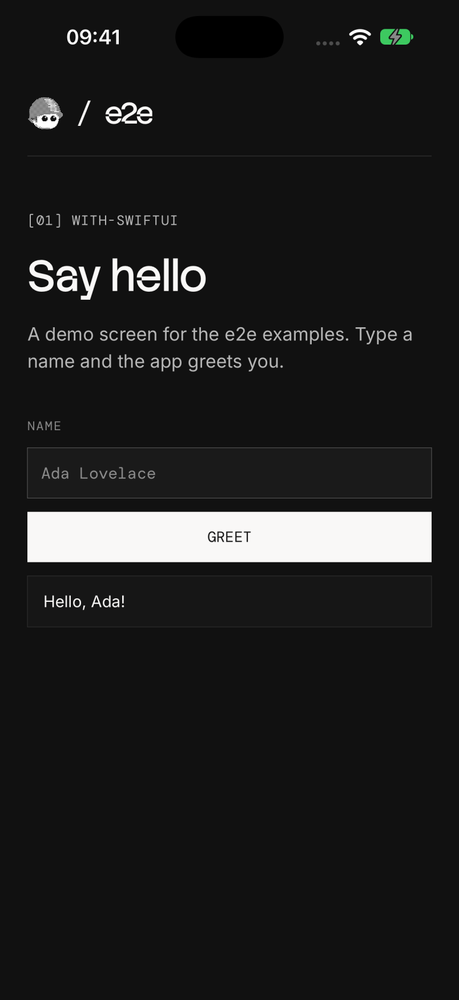
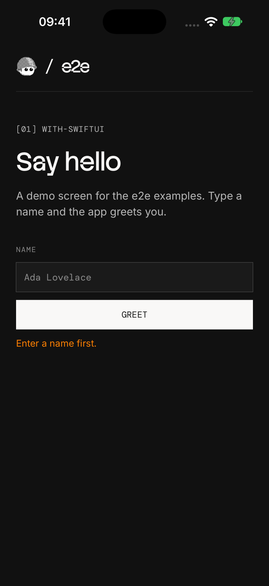

# e2e with SwiftUI

A SwiftUI greeting app with three locator tests and two agent tests.
The test project is in `e2e/`, next to the Xcode project.

 

## Run

Open `HelloApp.xcodeproj` in Xcode. Select the **HelloApp** scheme and an
iPhone simulator. Press **Run** to build and install the app. Stop the
Xcode run before you start the tests.

Use Node 22.22.3+, 24.8+, or 26+ for the tests. From this folder:

```bash
cd e2e
npm install
npx agent-device doctor
npm run test:e2e
```

After app changes, run the app in Xcode again before you run the tests.

## Agent tests

Set a [Vercel AI Gateway](https://vercel.com/docs/ai-gateway) key.
From `e2e/`:

```bash
AI_GATEWAY_API_KEY="your-key" npm run test:e2e
```

Without the key, the agent tests skip. Add `-- --no-cache` to use fresh
model calls. Results are in `e2e/.e2e/report.json`.

See [e2e/e2e.config.ts](e2e/e2e.config.ts) and [e2e/tests/](e2e/tests/) for the setup.
For device setup and CI, see the [Mobile guide](https://e2e.tester.army/docs/mobile).

The bundled fonts use the [SIL Open Font License](HelloApp/Fonts/OFL.txt).

Last checked on 2026-10-05 with e2e 0.15.2, @e2e-dev/mobile 0.9.2, and Xcode
27 on an iOS 27 simulator. All five tests passed, including the agent tests.
